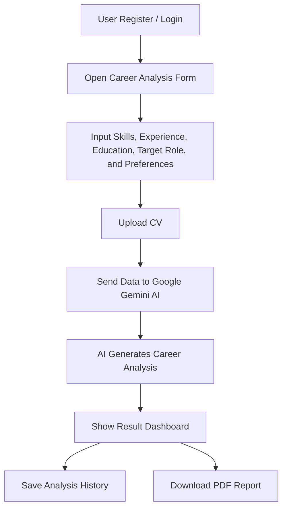

<div align="center">

<table>
  <tr>
    <td align="center" width="160">
      
    </td>
    <td align="center" width="160">
      
    </td>
  </tr>
</table>

# Career Helper — AI-Powered Career Analysis Platform

Career Helper is a modern career analysis web application powered by **Laravel** and **Google Gemini AI**.  
It helps users understand their skills, analyze their CV, receive AI-based career recommendations, and track their career growth over time.

<br>


</div>

---

## 📌 Project Overview

**Career Helper** is an AI-powered career analysis platform designed to help users evaluate their career readiness, understand their strengths and weaknesses, improve their CV, and receive personalized career recommendations.

The application is built with the **TALL Stack**:

- **Laravel** as the backend framework.
- **Livewire** as the reactive frontend engine.
- **Tailwind CSS** as the styling system.
- **Alpine.js** for lightweight frontend interactivity.

At the center of the application is **Google Gemini AI**, which acts as the intelligence engine. Gemini processes user inputs such as skills, experience, education, target role, work preference, location, CV content, projects, tools, and certifications to generate structured career insights.

---

## ✨ Features

| Feature | Description |
|---|---|
| 🔐 **Register & Login** | Provides a secure authentication system so every user can access their own personal career dashboard. |
| 📧 **Reset Password via Email** | Allows users to recover their account securely through a standard email-based password reset flow. |
| 🧾 **Reset Password via Username + Code** | Offers an alternative fallback recovery method using a unique username and verification code. |
| 🤖 **AI Career Analysis** | Uses Google Gemini AI to analyze user data and generate personalized career insights, skill evaluation, and role recommendations. |
| 📄 **CV Upload** | Supports CV upload and prepares the document for AI-assisted parsing, review, and career analysis. |
| 📊 **Result Page** | Displays AI-generated results inside a clean dashboard containing career breakdowns, scores, recommendations, and improvement areas. |
| 🕘 **History Analysis** | Stores previous AI analyses so users can monitor progress and compare their career growth over time. |
| 🖨️ **Download PDF Report** | Exports career analysis results into a professional, printable PDF report using DomPDF. |
| 🗑️ **Trash & Restore** | Supports soft delete management, allowing users to restore deleted history or related data when needed. |
| 👤 **Profile Settings** | Lets users manage profile information, username, bio, security settings, password updates, and account details. |
| 🔔 **SweetAlert Feedback** | Provides beautiful, modern, interactive notifications for successful actions, validation responses, and user feedback. |

---

## 🧰 Tech Stack

| Layer | Technology |
|---|---|
| **Backend** | Laravel, PHP |
| **Frontend Reactive Engine** | Livewire, Alpine.js |
| **Styling** | Tailwind CSS |
| **Database** | MySQL |
| **PDF Engine** | DomPDF |
| **AI Engine** | Google Gemini AI Integration |
| **Authentication** | Laravel Breeze / Laravel Auth System |
| **Notification UI** | SweetAlert |
| **Build Tool** | Vite |

---

## ⚙️ Installation & Setup

Follow these steps to install and run the project locally.

```bash
git clone https://github.com/username/career-helper.git
cd career-helper
composer install
npm install
copy .env.example .env
php artisan key:generate
php artisan migrate
npm run dev
php artisan serve
```

After running the commands above, open the application in your browser:

```bash
http://127.0.0.1:8000
```

---

## 🔑 Environment Configuration

After copying `.env.example` into `.env`, configure your local environment.

### Database Configuration

```env
DB_CONNECTION=mysql
DB_HOST=127.0.0.1
DB_PORT=3306
DB_DATABASE=career_helper
DB_USERNAME=root
DB_PASSWORD=
```

Make sure the database already exists before running migration:

```sql
CREATE DATABASE career_helper;
```

Then run:

```bash
php artisan migrate
```

---

## 🧠 Google Gemini AI Configuration

To enable AI-powered career analysis, add your Gemini API key to the `.env` file.

```env
GEMINI_API_KEY=your_gemini_api_key_here
GEMINI_MODEL=gemini-flash-latest
```

> Keep your API key private. Never upload your `.env` file to GitHub.

If the project uses a dedicated service class, the Gemini integration is commonly handled inside a service such as:

```bash
app/Services/CareerAnalysisService.php
```

This service is responsible for sending user career data to Gemini AI and returning structured analysis results to the application.

---

## 🗂️ Project Structure

```bash
career-helper/
├── app/
│   ├── Http/
│   │   ├── Controllers/
│   │   └── Requests/
│   ├── Models/
│   └── Services/
│       └── CareerAnalysisService.php
├── database/
│   ├── migrations/
│   └── seeders/
├── public/
├── resources/
│   ├── views/
│   │   ├── auth/
│   │   ├── components/
│   │   ├── layouts/
│   │   └── career/
│   ├── css/
│   └── js/
├── routes/
│   ├── web.php
│   └── auth.php
├── storage/
├── .env.example
├── composer.json
├── package.json
└── README.md
```

---

## 🚀 Main Application Flow



---

## 🧪 Usage Guide

### 1. Create an Account

Register a new account or log in using an existing account.

### 2. Fill Career Data

Enter career-related information such as:

- Education background
- Target role
- Career interest
- Hard skills
- Soft skills
- Tools or technologies
- Projects
- Certifications
- Work preference
- Location

### 3. Upload CV

Upload your CV so the system can prepare it for AI-assisted career analysis.

### 4. Run AI Analysis

Submit the form and let Google Gemini AI process your data.

### 5. Review Result

The result page displays your career breakdown, strengths, weaknesses, score, recommendations, and suggested improvements.

### 6. Export Report

Download the analysis result as a clean PDF report.

---

## 📄 PDF Report

Career Helper uses **DomPDF** to generate printable PDF reports from AI analysis results.

Install DomPDF if it is not already installed:

```bash
composer require barryvdh/laravel-dompdf
```

Example output includes:

- User profile summary
- Career readiness score
- Skill analysis
- CV analysis
- Recommended roles
- Improvement roadmap
- Final AI recommendation

---

## 🗑️ Soft Delete, Trash & Restore

Career Helper supports soft delete behavior for selected data such as analysis history or uploaded files.

Common commands used during development:

```bash
php artisan migrate
```

Example model setup:

```php
use Illuminate\Database\Eloquent\SoftDeletes;

class AiAnalysis extends Model
{
    use SoftDeletes;
}
```

This allows deleted records to be restored instead of being permanently removed.

---

## 🔔 SweetAlert Notifications

SweetAlert is used to provide clean and modern feedback for user actions.

Examples of feedback messages:

- `Password Berhasil di Update`
- `Username Berhasil diganti`
- `Name berhasil diganti`
- `Data berhasil disimpan`
- `Analisis berhasil dibuat`
- `Data berhasil dipulihkan`
- `Data berhasil dihapus`

---

## 🛡️ Security Notes

For production deployment, make sure to follow these rules:

```env
APP_ENV=production
APP_DEBUG=false
```

Never commit sensitive files or credentials:

```bash
.env
/storage/*.key
```

Recommended security practices:

- Use strong password validation.
- Keep Gemini API keys private.
- Use HTTPS in production.
- Validate uploaded CV files.
- Restrict file types and file size.
- Protect authenticated routes with middleware.
- Avoid exposing raw AI responses directly to users.

---

## 🌐 Deployment Notes

Before deploying the project, run:

```bash
composer install --optimize-autoloader --no-dev
npm run build
php artisan config:cache
php artisan route:cache
php artisan view:cache
php artisan migrate --force
```

Make sure the following folders are writable:

```bash
storage/
bootstrap/cache/
```

Create the storage symbolic link if your project stores uploaded files publicly:

```bash
php artisan storage:link
```

---

## 🧾 GitHub Upload Notes

Before pushing the project to GitHub, make sure `.env` is ignored.

Example `.gitignore` essentials:

```gitignore
/vendor
/node_modules
/public/build
/storage/*.key
.env
.env.backup
.phpunit.result.cache
```

Then push the project:

```bash
git init
git add .
git commit -m "Initial commit: Career Helper AI platform"
git branch -M main
git remote add origin https://github.com/username/career-helper.git
git push -u origin main
```

---

## 🧭 Roadmap

Planned improvements:

- [ ] Advanced CV text extraction
- [ ] Multi-language AI analysis
- [ ] Role-based career roadmap
- [ ] Job vacancy recommendation
- [ ] Skill gap visualization chart
- [ ] Admin dashboard
- [ ] More detailed PDF report template
- [ ] AI-powered interview preparation
- [ ] AI-based LinkedIn profile review

---

## 🤝 Contributing

Contributions are welcome.

To contribute:

1. Fork the repository.
2. Create a new branch.
3. Make your changes.
4. Commit your changes.
5. Push to your branch.
6. Open a pull request.

```bash
git checkout -b feature/your-feature-name
git commit -m "Add your feature"
git push origin feature/your-feature-name
```

---

## 📜 License

This project is open-source and available under the **MIT License**.

---

## 🙌 Acknowledgements

This project was built using:

- [Laravel](https://laravel.com/)
- [Livewire](https://livewire.laravel.com/)
- [Tailwind CSS](https://tailwindcss.com/)
- [Alpine.js](https://alpinejs.dev/)
- [Google Gemini AI](https://ai.google.dev/)
- [DomPDF](https://github.com/barryvdh/laravel-dompdf)
- [SweetAlert](https://sweetalert2.github.io/)

---

<div align="center">

### Career Helper

**Analyze your skills. Improve your CV. Build your career path with AI.**

Made with Laravel, Tailwind CSS, Livewire, and Google Gemini AI.

</div>
