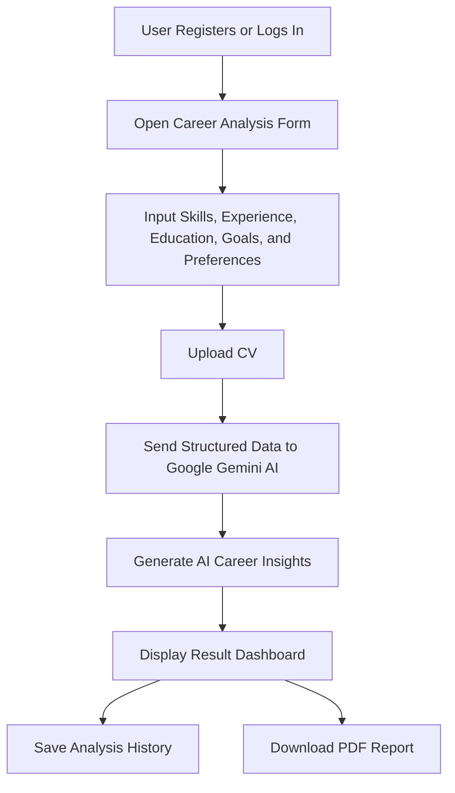

<p align="center">
  
  <span style="font-size: 30px; margin: 0 20px; position: relative; top: -15px;">✕</span>
  
</p>

<h1 align="center">Career Helper — AI-Driven Career Optimization Platform</h1>

<p align="center">
  A sophisticated web application built on the TALL Stack, leveraging Google Gemini AI to analyze CVs and provide deep career insights.
</p>

<p align="center">
  
  
  
  
</p>

---

## Overview

**Career Helper** is an AI-driven career optimization platform designed to help users understand their professional profile, evaluate their CV, and receive tailored career recommendations through intelligent automation.

The platform bridges the gap between job seekers and modern AI technology by combining Laravel’s robust backend architecture with reactive, user-friendly interfaces powered by Livewire and Alpine.js. At its core, **Google Gemini AI** functions as the reasoning engine that interprets user data, identifies competency gaps, analyzes career readiness, and generates actionable development recommendations.

Whether users are preparing for their first job, improving their CV, switching roles, or mapping a long-term career path, Career Helper provides a structured and intelligent way to make better career decisions.

---

## Key Features

| Feature | Description |
|---|---|
| 🔐 **Register & Login** | Secure and streamlined authentication system that allows users to safely access their personal career workspace. |
| 📧 **Reset Password via Email** | Standard secure password recovery workflow using tokenized email links for safe account restoration. |
| 🔑 **Reset Password via Username + Code** | Alternative fallback recovery method using unique usernames and verification codes when email recovery is unavailable. |
| 🤖 **AI Career Analysis** | Core feature powered by Google Gemini AI, delivering deep and tailored insights into the user’s career path, skills, and readiness. |
| 📄 **CV Upload** | Fast document upload flow prepared for PDF and Word CV parsing, making user data easier to process and analyze. |
| 📊 **Result Page** | Interactive dashboard displaying AI-generated breakdowns, career scores, competency gaps, recommendations, and next-step guidance. |
| 📜 **History Analysis** | Chronological log that allows users to review previous analyses and track the evolution of their career profile over time. |
| 🖨️ **Download PDF Report** | Production-ready PDF exporting system powered by DomPDF for clean, printable, and shareable AI career reports. |
| 🗑️ **Trash & Restore** | Soft-delete mechanism that allows safe management and restoration of deleted analysis histories. |
| ⚙️ **Profile Settings** | Complete control over user profile data, account security, avatar configuration, and personal information. |
| 🔔 **SweetAlert Feedback** | Smooth, responsive, and visually polished modal notifications that create a premium interaction experience. |

---

## Tech Stack

| Category | Technology |
|---|---|
| **Backend Framework** | Laravel |
| **Programming Language** | PHP |
| **Frontend Reactive Layer** | Livewire & Alpine.js |
| **UI & Styling** | Tailwind CSS |
| **Database Engine** | MySQL |
| **Document Rendering** | DomPDF |
| **Intelligence Core** | Google Gemini AI Integration |
| **Build Tooling** | Vite |
| **Alert System** | SweetAlert |

---

## Installation & Setup

Follow the steps below to run Career Helper locally.

```bash
git clone https://github.com/username/career-helper.git
cd career-helper
composer install
npm install
copy .env.example .env
php artisan key:generate
php artisan migrate
npm run dev
php artisan serve
```

After starting the development server, open the application at:

```bash
http://127.0.0.1:8000
```

> On Windows, use `copy .env.example .env`.  
> On macOS or Linux, use `cp .env.example .env`.

---

## Environment Configuration

Before running the application, configure your `.env` file.

### Application

```env
APP_NAME="Career Helper"
APP_ENV=local
APP_KEY=
APP_DEBUG=true
APP_URL=http://127.0.0.1:8000
```

### Database

```env
DB_CONNECTION=mysql
DB_HOST=127.0.0.1
DB_PORT=3306
DB_DATABASE=career_helper
DB_USERNAME=root
DB_PASSWORD=
```

Create the database before running migrations:

```sql
CREATE DATABASE career_helper;
```

Then run:

```bash
php artisan migrate
```

---

## Google Gemini AI Setup

Career Helper uses Google Gemini AI as its intelligent analysis engine. Add your Gemini API credentials to the `.env` file:

```env
GEMINI_API_KEY=your_gemini_api_key_here
GEMINI_MODEL=gemini-flash-latest
```

A typical AI service layer may be placed in:

```bash
app/Services/CareerAnalysisService.php
```

This service can be responsible for:

- Preparing career profile data.
- Sending structured prompts to Gemini AI.
- Receiving AI-generated analysis.
- Normalizing the response into application-ready data.
- Saving career analysis results into the database.

> Never commit your `.env` file or private API keys to GitHub.

---

## Application Flow



---

## Career Analysis Input

Career Helper can analyze multiple user profile dimensions, including:

- Full name
- Education background
- Target role
- Career interests
- Work experience
- Hard skills
- Soft skills
- Tools and technologies
- Certifications
- Projects
- Work preferences
- Preferred location
- CV content or uploaded CV file

These data points help Gemini AI produce a more accurate and contextual career recommendation.

---

## AI Result Output

The AI-generated result can include:

| Output | Description |
|---|---|
| **Profile Summary** | Short overview of the user’s current career profile. |
| **Skill Analysis** | Evaluation of hard skills, soft skills, tools, and technical readiness. |
| **CV Review** | Feedback on CV clarity, structure, relevance, and improvement areas. |
| **Career Score** | Numerical or qualitative score representing career readiness. |
| **Recommended Roles** | Suggested roles based on user strengths, interests, and experience. |
| **Skill Gap Analysis** | Missing or weak skills that should be improved for the target role. |
| **Improvement Roadmap** | Actionable learning steps to increase job readiness. |
| **Final Recommendation** | Clear AI-generated advice for the user’s next career move. |

---

## PDF Report

Career Helper supports PDF report generation using DomPDF.

Install DomPDF if it is not already included:

```bash
composer require barryvdh/laravel-dompdf
```

Example PDF report sections:

- User profile summary
- Career readiness score
- CV analysis
- Skill analysis
- Recommended roles
- Competency gaps
- Improvement roadmap
- Final AI recommendation

---

## Suggested Folder Structure

```bash
career-helper/
├── app/
│   ├── Http/
│   │   ├── Controllers/
│   │   └── Requests/
│   ├── Models/
│   └── Services/
│       └── CareerAnalysisService.php
├── database/
│   ├── migrations/
│   └── seeders/
├── public/
├── resources/
│   ├── views/
│   │   ├── auth/
│   │   ├── career/
│   │   ├── components/
│   │   └── layouts/
│   ├── css/
│   └── js/
├── routes/
│   ├── web.php
│   └── auth.php
├── storage/
├── tests/
├── .env.example
├── composer.json
├── package.json
└── README.md
```

---

## Security Practices

Recommended security practices for this project:

- Keep `.env` private and excluded from version control.
- Validate CV uploads by file type and file size.
- Sanitize and validate all user inputs.
- Protect authenticated routes using middleware.
- Store passwords using Laravel’s hashing system.
- Avoid exposing raw AI responses directly without formatting or validation.
- Use HTTPS in production.
- Set `APP_DEBUG=false` in production.
- Rotate API keys if they are accidentally exposed.

Production environment example:

```env
APP_ENV=production
APP_DEBUG=false
```

---

## GitHub Push Notes

Make sure these files and folders are ignored:

```gitignore
/vendor
/node_modules
/public/build
/storage/*.key
.env
.env.backup
.phpunit.result.cache
```

Push the project:

```bash
git add .
git commit -m "Initial commit: Career Helper AI platform"
git push origin main
```

---

## Deployment Checklist

Before deploying the application, run:

```bash
composer install --optimize-autoloader --no-dev
npm run build
php artisan config:cache
php artisan route:cache
php artisan view:cache
php artisan migrate --force
```

Make sure these directories are writable:

```bash
storage/
bootstrap/cache/
```

If the application stores uploaded CV files publicly, create the storage symbolic link:

```bash
php artisan storage:link
```

---

## Roadmap

Planned improvements:

- [ ] Advanced CV text extraction
- [ ] Word document parsing support
- [ ] Multi-language AI analysis
- [ ] AI-powered job matching
- [ ] Skill gap visualization charts
- [ ] Personalized learning roadmap
- [ ] Interview preparation assistant
- [ ] LinkedIn profile review
- [ ] Admin dashboard
- [ ] More advanced PDF templates
- [ ] Export history as CSV or PDF bundle

---

## Contributing

Contributions are welcome.

To contribute:

1. Fork the repository.
2. Create a new feature branch.
3. Make your changes.
4. Commit your work.
5. Push your branch.
6. Open a pull request.

```bash
git checkout -b feature/your-feature-name
git add .
git commit -m "Add your feature"
git push origin feature/your-feature-name
```

---

## License

This project is open-source and available under the **MIT License**.

---

## Acknowledgements

Career Helper is built with the help of:

- Laravel
- Livewire
- Alpine.js
- Tailwind CSS
- MySQL
- DomPDF
- SweetAlert
- Google Gemini AI

---

<p align="center">
  <strong>Career Helper</strong><br>
  Analyze your skills. Improve your CV. Build your career path with AI.
</p>
